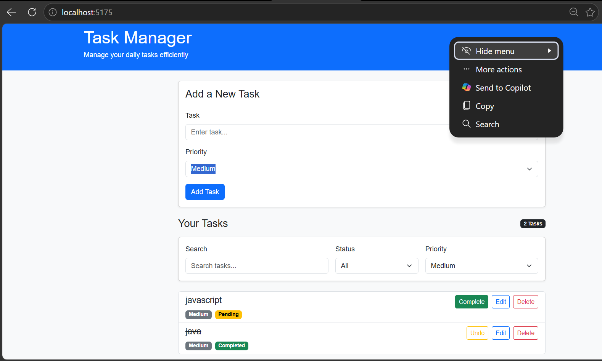

# Task Manager

A responsive task management web application built with **React** and **Bootstrap 5**.

## Preview



## Features

* Add new tasks
* Set task priority: Low, Medium, or High
* Mark tasks as completed or undo completion
* Edit task title and priority
* Delete tasks
* Search tasks
* Filter tasks by status
* Filter tasks by priority
* Save tasks using browser local storage
* Responsive design for desktop and mobile screens
* Form validation

## Technologies Used

* React
* JavaScript
* Bootstrap 5
* HTML5
* CSS3
* Vite
* Git
* GitHub

## React Concepts Practised

* Functional components
* JSX
* Props
* `useState`
* `useEffect`
* Controlled inputs
* Event handling
* Parent-child communication
* Lifting state up
* Conditional rendering
* `map()`
* `filter()`
* State updates using the spread operator
* Component composition

## Project Structure

```text
src/
├── App.jsx
├── Header.jsx
├── TaskForm.jsx
├── TaskItem.jsx
├── TaskList.jsx
├── main.jsx
└── index.css
```

## Getting Started

Clone the repository:

```bash
git clone https://github.com/sangam-aishwarya/task-manager.git
```

Navigate to the project:

```bash
cd task-manager
```

Install dependencies:

```bash
npm install
```

Start the development server:

```bash
npm run dev
```

Open the local URL provided by Vite in your browser.

## Purpose

This project was built to practise React fundamentals and modern frontend development, including state management, reusable components, responsive UI, and browser storage.
